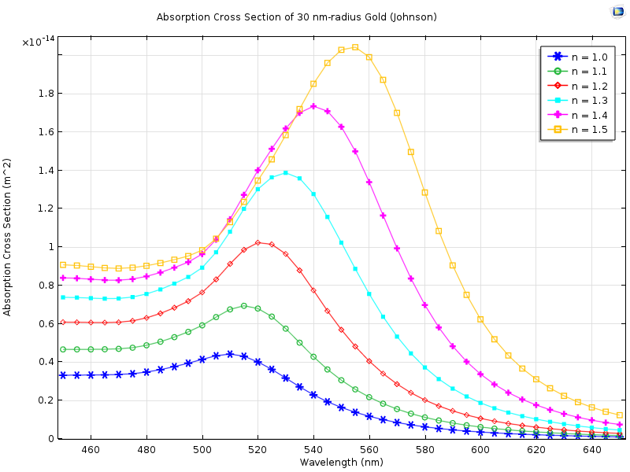
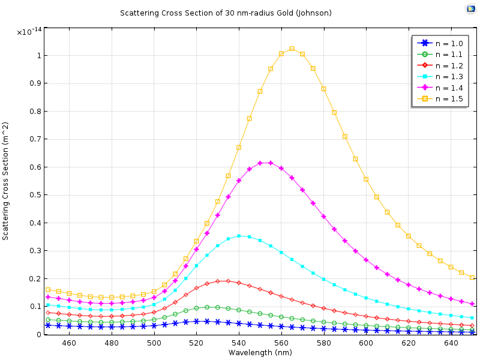

This is a technical report aiming at calculating the scattering, absorption and extinction cross sections of a single gold nanoparticle with finite element method (FEM, COMSOL Multiphysics). The dielectric functions from Johnson are used in the calculation.

## Modeling

1. Comsol model exchange for [Mie scattering.](https://www.comsol.com/community/exchange/215/)
2. The scaling factor, or the value of the Poynting vector, should be set correctly.

The scaling factor shown above is right when the surrounding medium is air with refractive index of 1. in general, we have 

$$S=\frac{E_{0}^{2}}{2 \eta}=\frac{E_{0}^{2}}{2 \eta_0} \cdot n$$

## Results

Absorption cross section

Scattering cross section

