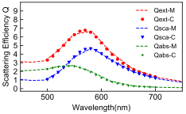

#### Task 1. Derive the analytical solution (Mie theory)

1. A good tutorial is [here](http://yingsamuelhu.blogspot.com/p/mie-theory-for-multilayer-spheres.html).

2. The classical textbook by Bohren and Huffman.

`C. F. Bohren and D. R. Huffman, Absorption and Scattering of Light by Small Particles, 1998, vol. 1.`

3. The  extinction and scattering cross sections are

   $$\sigma_{sca}=\frac{2 \pi}{\mathrm{k}^{2}} \sum_{n=1}^{\infty}(2 n+1)\left(\left|a_{n}\right|^{2}+\left|b_{n}\right|^{2}\right)$$

   $$\sigma_{e x t}=\frac{2 \pi}{\mathrm{k}^{2}} \operatorname{Re}\left(a_{n}+b_{n}\right)$$

   The coefficients are

   $$a_{n}=\frac{m \psi_{n}(m x) \psi_{n}^{\prime}(x)-\psi_{n}(x) \psi_{n}^{\prime}(m x)}{m \psi_{n}(m x) \xi_{n}^{\prime}(x)-\xi_{n}(x) \psi_{n}^{\prime}(m x)}$$

   $$b_{n}=\frac{\psi_{n}(m x) \psi_{n}^{\prime}(x)-m \psi_{n}(x) \psi_{n}^{\prime}(m x)}{\psi_{n}(m x) \xi_{n}^{\prime}(x)-m \xi_{n}(x) \psi_{n}^{\prime}(m x)}$$

   in which $\psi$ and $\xi$ are Ricatti-Bessel functions of order $n$.


#### Task 2. Calculate the scattering and absorption cross sections in Python

```Python
# -*- coding: utf-8 -*-
"""
Created on Sun Jul 16 13:46:58 2017

@author: qli14
"""
from numpy import arange, pi, cos, real, imag, sqrt, genfromtxt
import matplotlib.pyplot as plt
from scipy.special import spherical_jn, spherical_yn

plt.close('all')
plt.rcdefaults()
plt.rc('font',**{'family':'sans-serif','sans-serif':['Arial'],'size':10})

## Define the Riccati-Bessel function psi
def psi(n,z):
    y = z*spherical_jn(n,z)
    return y
## Define the derivative of psi
def dpsi(n,z):
    y = spherical_jn(n,z)+z*spherical_jn(n,z,derivative=True)
    return y
## Define the Riccati-Bessel function xi
def xi(n,z):
    y = z*(spherical_jn(n,z)+1j*spherical_yn(n,z))
    return y
## Define the derivative of xi
def dxi(n,z):
    y = spherical_jn(n,z)+z*spherical_jn(n,z,derivative=True) \
    +1j*(spherical_yn(n,z)+z*spherical_yn(n,z,derivative=True))
    return y

## Define the scattering coefficient an
def an(n,m,x):
    y = (m*psi(n,m*x)*dpsi(n,x)-psi(n,x)*dpsi(n,m*x)) \
        /(m*psi(n,m*x)*dxi(n,x)-xi(n,x)*dpsi(n,m*x))
    return y
## Define the scattering coefficient bn
def bn(n,m,x):
    y = (psi(n,m*x)*dpsi(n,x)-m*psi(n,x)*dpsi(n,m*x))  \
        /(psi(n,m*x)*dxi(n,x)-m*xi(n,x)*dpsi(n,m*x))
    return y

## Import the complex refractive index of gold
data = genfromtxt('Johnson-gold-n-k.txt',delimiter='\t',
                  skip_header=1)

wl = data[:,0] # wavelength in micrometer
realn = data[:,1] # real part of the complex refractive index
imagk = data[:,2] # imaginary part of the complex refractive index

## Wavelength in nanometer
wl = wl*1000

## Permittivity of the sphere
epsilon = (realn+1j*imagk)**2

## Refractive index of the medium in which the sphere is embedded
ReIndex = 1.33

## Radius of the sphere in nanometer
radius = 50

x = 2*pi*ReIndex/wl*radius # dimensionless

m = sqrt(epsilon)/ReIndex
        
## The number of iterations in the series
iteration = 40

## The total extinction efficiency
Qext = 0.0
Qsca = 0.0

for n in range(1,iteration+1):
    Qext = Qext + 2/x**2*(2*n+1)*real(an(n,m,x)+bn(n,m,x))
    Qsca = Qsca + 2/x**2*(2*n+1)*(abs(an(n,m,x))**2+abs(bn(n,m,x))**2)

Qabs = Qext-Qsca

## Import the data from Comosl
data2 = genfromtxt('20170721-gold-nanoparticle-scattering-efficiency.txt',
                   skip_header=1)
wl2 = data2[:,0] # wavelength in nanometer
Qsca_comsol = data2[:,1]
Qabs_comsol = data2[:,2]
Qext_comsol = data2[:,3]

fig, ax = plt.subplots(figsize=(3.25,2.00))

ax.plot(wl,Qext,'r--',linewidth=1,markersize=3,label='Qext-M')
ax.plot(wl2,Qext_comsol,'ro',linewidth=1,markersize=3,label='Qext-C')
## Scaling factor of 1/n, n is the refractive index of the medium


ax.plot(wl,Qsca,'b--',linewidth=1,markersize=3,label='Qsca-M')
ax.plot(wl2,Qsca_comsol,'bv',linewidth=1,markersize=3,label='Qsca-C')

ax.plot(wl,Qabs,'g--',linewidth=1,markersize=3,label='Qabs-M')
ax.plot(wl2,Qabs_comsol,'g+',linewidth=1,markersize=3,label='Qabs-C')

## Set xlim and ylim
ax.set_xlim([450,750])
ax.set_ylim([-0.3,+10])

# Set xticks and yticks
plt.tick_params(axis='both', direction='in')
ax.set_xticks(range(500,710,100))
ax.set_yticks(range(0,10,1))
    
# Set labels
ax.set_xlabel('Wavelength(nm)')
ax.set_ylabel('Scattering Efficiency Q')

## Show the legend
ax.legend(loc='upper right',shadow=False, frameon=False, fontsize=8)

# Adjust the position of axis
plt.subplots_adjust(left=0.11,right=0.98,bottom=0.20,top=0.98)

# save figure
#fig.savefig('20170721-gold-nanoparticle-scattering-efficiency.svg')

# show the figure
fig.show()


```


#### Task 3. Simulate the scattering with finite element method (Comsol)

1. Comsol model exchange for [Mie scattering.](https://www.comsol.com/community/exchange/215/)
2. When setting the energy flux, it's important to consider the refractive index of the medium in which the nanoparticle is embedded. Otherwise, the scattering, absorption, and extinction cross sections from FEM will be increased by a factor of $n$.
   $S=\frac{E_{0}^{2}}{2 \eta}=\frac{E_{0}^{2}}{2 \eta_0} \cdot n$

#### Task 4. Compare and discuss the numerical and analytical results

Mie theory and Comsol simulation.




